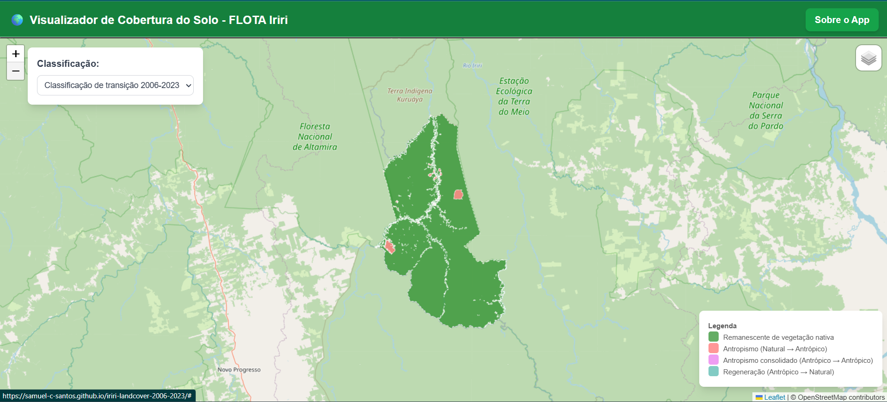

## 🌱 Visualizador de Mudanças de Cobertura do Solo – Floresta Estadual do Iriri

Este aplicativo interativo permite visualizar e comparar as mudanças na cobertura do solo na **Floresta Estadual do Iriri (PA)** entre os anos de **2006** e **2023**, utilizando dados da **Coleção 6 do MapBiomas**, processados no **Google Earth Engine (GEE)** e tratados no **QGIS** para visualização com **Leaflet.js**.

---

### 📌 Funcionalidades

* Visualização da cobertura do solo em **2006** e **2023**
* Classificação de **transições de uso** (ex: Remanescente, Antropismo, Regeneração)
* Legenda interativa com cores compatíveis com o MapBiomas
* Diferentes camadas base (Google Satélite, OSM, Sentinel-2, Bing)
* Interface responsiva, com modal explicativo

---

### 🌍 Sobre os dados

* **Fonte**: [MapBiomas – Coleção 6](https://brasil.mapbiomas.org/colecoes-mapbiomas)
* **Processamento inicial**: realizado via Google Earth Engine, com recorte espacial sobre a **Floresta Estadual do Iriri**, Unidade de Conservação de Uso Sustentável localizada no sudoeste do Pará.
* **Camada exportada**: `flota_iriri_cobertura_solo_2006_2023.geojson`

---

### 🛠️ Processamento dos Dados (QGIS)

Após exportação dos dados classificados do GEE, foi realizado o seguinte fluxo de tratamento no **QGIS**:

1. **Poligonização** das classes de uso do solo dos anos 2006 e 2023 a partir de raster categórico.
2. **Interseção espacial** entre as duas camadas vetoriais para gerar as unidades mínimas de análise de transição.
3. **Categorização lógica das transições**:

   * `Remanescente de vegetação nativa`: natural → natural
   * `Antropismo`: natural → antrópico
   * `Regeneração`: antrópico → natural
   * `Antropismo consolidado`: antrópico → antrópico
4. **Criação de campo auxiliar `transicao_cobertura`** usando a Calculadora de Campo.
5. **Atribuição de cores e exportação final como GeoJSON** para uso no aplicativo web.

Esse tratamento garantiu que as análises fossem espacialmente coerentes e semanticamente padronizadas com a legenda oficial do MapBiomas.

---

### 🌐 Acesso Online

O aplicativo está disponível em:

👉 [https://samuel-c-santos.github.io/iriri-landcover-2006-2023/](https://samuel-c-santos.github.io/iriri-landcover-2006-2023/)

---

### ✨ Créditos

* **Desenvolvimento e análise**: [Samuel C. Santos](https://www.linkedin.com/in/samuelsantos-amb/)
* **Dados**: Projeto [MapBiomas](https://mapbiomas.org/), via [Google Earth Engine](https://code.earthengine.google.com/)
* **Processamento vetorial**: [QGIS](https://qgis.org/)
* **Visualização**: [Leaflet.js](https://leafletjs.com/), [Tailwind CSS](https://tailwindcss.com/)

---

### 📁 Portfólio e Contato

- 🌐 Portfólio: [https://samuel-c-santos.github.io/](https://samuel-c-santos.github.io/)
- 💼 LinkedIn: [@samuelsantos-amb](https://www.linkedin.com/in/samuelsantos-amb/)
- 📧 Contato: [https://github.com/samuel-c-santos](https://github.com/samuel-c-santos)